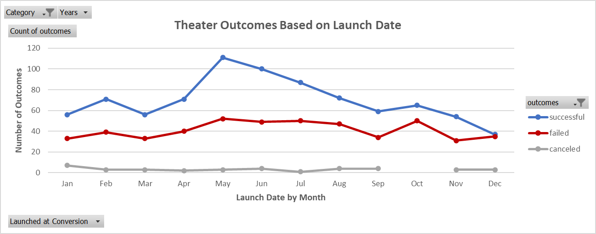
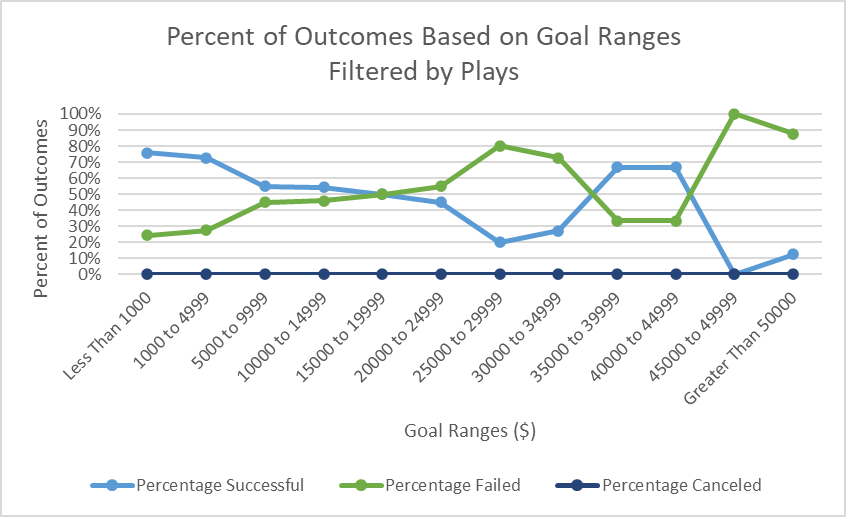

# Kickstarting_Analysis_Challenge
UT McCombs Data Boot Camp Module 1: Kickstarting with Excel

## Overview of Project
1. Import data into a table for analysis.   
2. Apply filters, conditional formatting, and formulas.   
3. Generate and interpret pivot tables.   
4. Calculate summary statistics such as measures of central tendency, standard deviation, and variance.  
5. Characterize data to identify outliers in datasets.  
6. Perform an Excel analysis with visualizations.  
7. Interpret common Excel visualizations.  

### Purpose
As part of a class assignment for the UT Data Boot Camp, an initial analysis of Kickstarter data was conducted to assist a client to determine the timing of her fundraising goal for a play.  After falling short of her fundraising goal, she asked for a follow up analysis. 

From the first analysis, it was determined that launch dates and goal amounts were heavy influences of successful outcomes.  For this analysis, we will determine the number of successful, failed, or canceled outcomes viewed through the lens of the launch dates by month and the funding goal ranges.

## Analysis and Challenges

### Analysis of Outcomes Based on Launch Date
Due to the client's interest in the theater data, the data was filtered by that category.  The number of live outcomes were nominal and were filtered from the data set.  

### Analysis of Outcomes Based on Goals
Due to the nominal number of live outcomes, the data was again filtered from the data set.  The client's main interest is in the plays subcategory, so an additional filter was applied.  The goals were then binned into groups of $5000.  The total number of successful, failed, and canceled outcomes were calculated for each bin and then converted into percentages.

### Challenges and Difficulties Encountered
The percentage of canceled projects had all zeros, which could have indicated a calculation error.  The formulas were checked and verified for accuracy.  The raw data was filtered to confirm that no canceled plays existed. 

## Results

### What are two conclusions you can draw about the Outcomes based on Launch Date?
<ol>
  <li> Viewing the line graph, the key months to launch a successful theater project are May and June, which declines through the end of the year.  
  <li> There are also very few canceled theater projects.
</ol>

### What can you conclude about the Outcomes based on Goals?
From the graph, the most successful percentages of outcomes are projects with goals that are less than $5000 goals or between $35000 and $50000. 

### What are some limitations of this dataset?
There is limited data on canceled theater projects and there were no examples of canceled plays in the subcategories.  

### What are some other possible tables and/or graphs that we could create?
<ol>
  <li> We could create a new calculated field that counts the number of months or days between the launch and deadline dates and cross that with the number of outcomes, and then turn that into a marked line graph.  
  <li> In both analyses, the spotlight and staff pick were not investigated for impact on outcomes. 
</ol>
